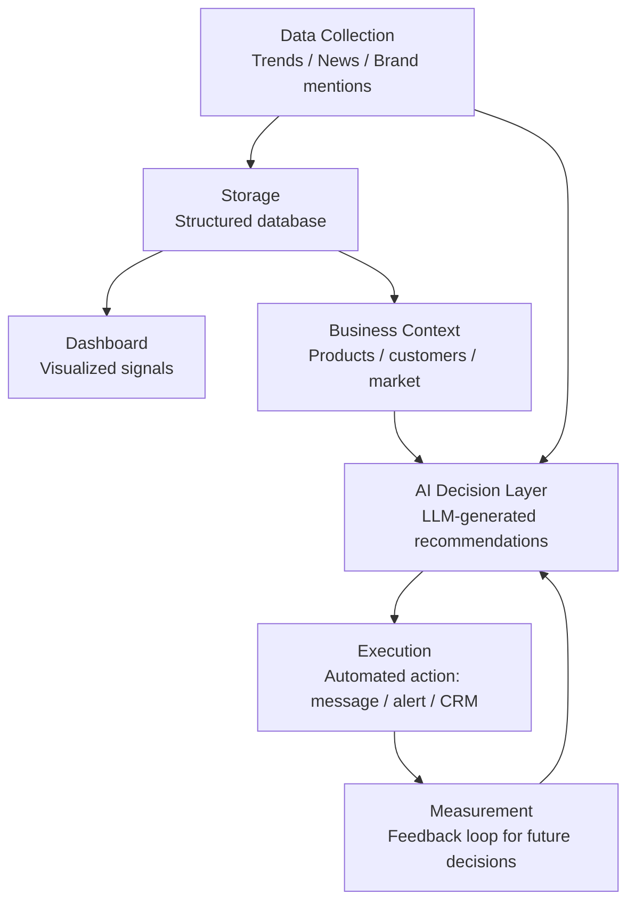

# AI-Powered Marketing Intelligence Platform

> An end-to-end system that collects market signals, turns them into AI-generated strategic recommendations, and automatically executes actions based on them — built as a proof-of-concept for applying AI/LLM systems to real business decision-making.

---

## 📌 Overview

This project explores how AI can move beyond simple chatbots into **real business decision pipelines**: collecting data automatically, using an LLM to reason over that data in context, and triggering real-world actions from the result — with a human able to observe and validate every step.

It was built as a personal project to apply and demonstrate practical AI engineering skills — including LLM integration, prompt design, workflow automation, and system architecture for AI-driven products — alongside a traditional software engineering background in C#/.NET.

---

## 🧠 Why this project (AI focus)

Most portfolio projects use AI as a single API call in an isolated demo. This project is built differently — it treats AI as **one component inside a larger data pipeline**, which is closer to how AI is actually deployed in real products:

- **Data engineering** — collecting and structuring real-world data before AI ever sees it (garbage in, garbage out is the first problem solved here, not the last)
- **Prompt engineering** — designing prompts that combine live external data + business-specific context to produce grounded, non-generic recommendations
- **AI as a decision layer** — using an LLM not just to generate text, but to score, prioritize, and recommend actions
- **Automation of AI output** — closing the loop by having the AI's recommendation trigger a real action, not just display text on a screen
- **System design around AI limitations** — deliberately separating what the LLM should decide (Phase 4) from what needs real historical data instead (Phase 6 / forecasting), rather than treating AI as a solution to everything

---

## 🏗️ Architecture



The system is organized into 5 core building blocks that stay consistent across the whole pipeline:

| Block | Responsibility |
|---|---|
| **Collect** | Pull external signals (trends, news, brand mentions) on a schedule |
| **Store** | Persist raw and processed data for later use |
| **Show** | Visualize what's been collected |
| **Decide** | Feed data + business context into an LLM to generate a recommendation |
| **Act** | Automatically execute the recommendation (notification, message, CRM update) |

---

## ⚙️ Tech Stack

| Layer | Tools |
|---|---|
| Backend | Python, FastAPI |
| AI / LLM | OpenAI API / Anthropic API — prompt-engineered recommendation generation |
| Automation | n8n (workflow orchestration connecting data → AI → action) |
| Data collection | pytrends (Google Trends), NewsAPI / GNews |
| Storage | Supabase (Postgres) |
| Dashboard | Streamlit, Plotly |
| Messaging/Actions | Telegram Bot API, Twilio (WhatsApp/SMS), email |
| Forecasting (roadmap) | Google Meridian, Prophet — for media-mix modeling once historical data exists |

---

## 🔍 Key AI/ML Concepts Applied

- **Prompt engineering** for grounded, context-aware LLM outputs rather than generic responses
- **Retrieval-style context injection** — feeding the LLM live collected data + structured business knowledge before it generates a recommendation
- **AI workflow orchestration** — connecting an LLM step into a broader automated pipeline (n8n), not using it as a standalone chatbot
- **Separating AI-suitable problems from data-dependent problems** — recognizing where an LLM is the right tool (Phase 4: reasoning over context) versus where true statistical modeling is needed instead (Phase 6: Media Mix Modeling, which requires historical data, not language generation)

---

## 🗺️ Roadmap / Phases

| Phase | Focus | Status |
|---|---|---|
| 1 | Intelligence Core — data collection | 🔲 Planned / In progress |
| 2 | Measurement Dashboard | 🔲 Planned |
| 3 | Business Knowledge Layer | 🔲 Planned |
| 4 | AI Decision Engine | 🔲 Planned |
| 5 | Execution Engine (automation) | 🔲 Planned |
| 6 | AI Science Layer (Media Mix Modeling, forecasting) | 🔲 Future — requires real historical usage data |

*(Update the status column as each phase is completed.)*

---

## 🎯 Background

This project was built by a **.NET developer** exploring practical AI system design outside of the .NET ecosystem, to better understand how AI/LLM integration works end-to-end in a real product — from data pipeline to automated decision-making. The architecture and reasoning behind each design choice are intentionally documented (see `/docs`) to demonstrate the thinking process, not just the final code.

---

## 📂 Project Structure

```
/docs         - architecture & planning documentation
/src          - application source code
/workflows    - n8n workflow exports
README.md     - this file
```

---

## 📄 License

MIT License — feel free to explore, learn from, or build on this project.

---

## 📬 Contact

Feel free to reach out if you'd like to discuss the project, the architecture decisions, or AI system design in general.
